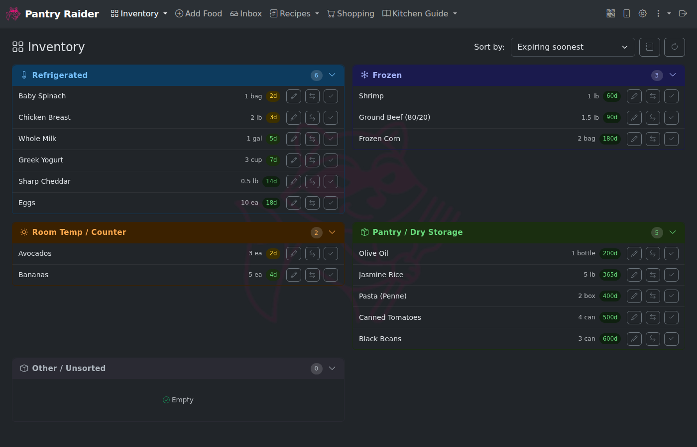
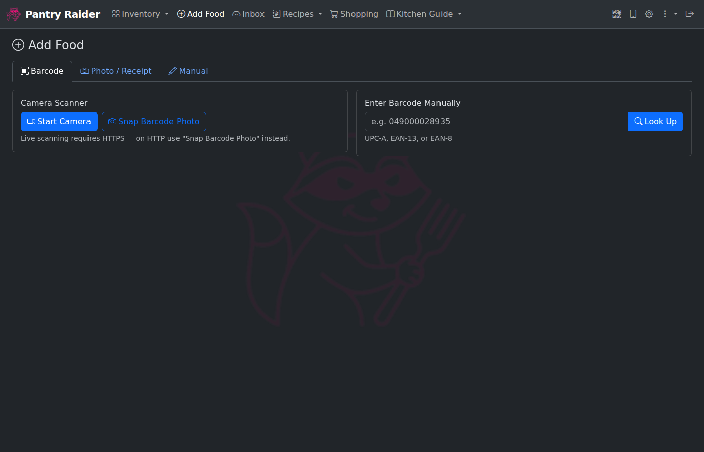
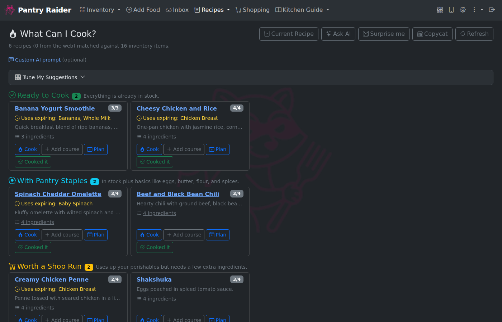
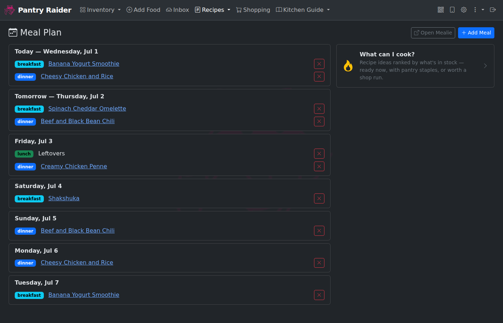
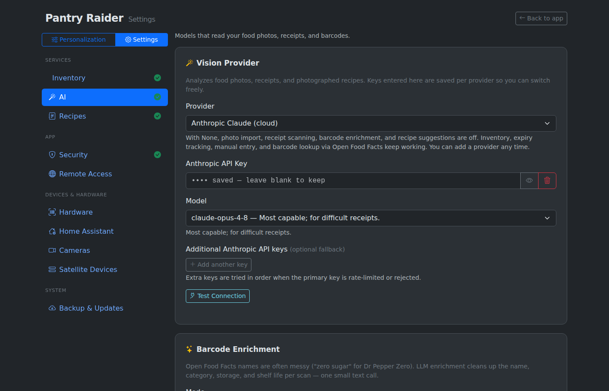
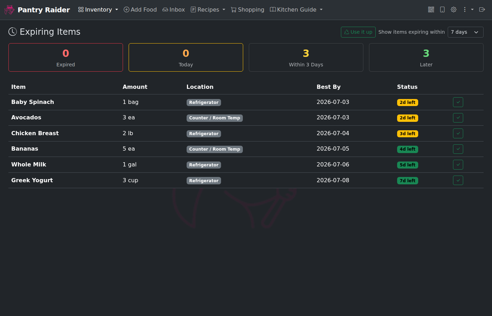

# Pantry Raider

[](https://github.com/Syracuse3DPrintingOrg/PantryRaider/actions/workflows/ci.yml)

A self-hosted food tracker that helps you manage what's in your fridge, reduce waste, and plan meals. Built to run entirely on your own hardware with no cloud dependency required.

Licensed under [PolyForm Noncommercial 1.0](LICENSE) - free for personal, educational, and non-commercial use.

---



*Inventory dashboard: four storage panels (Refrigerated, Frozen, Room Temp, Pantry) with drag-and-drop moves, inline edits, and expiry badges.*

---

## Why Pantry Raider?

[Grocy](https://grocy.info/) is an excellent, battle-tested self-hosted grocery and inventory manager. It handles product storage, stock levels, expiry tracking, and more. Pantry Raider uses Grocy as its inventory backbone.

What Pantry Raider adds on top:

- **AI-powered photo import** -- photograph a pile of groceries and get them all queued for review at once, without typing anything
- **Barcode scanning with LLM enrichment** -- scan barcodes via camera, USB scanner, or manual entry; [Open Food Facts](https://world.openfoodfacts.org) provides product data, and an optional LLM pass cleans up messy names and fills in gaps
- **Stream Deck kiosk** -- a dedicated kitchen control surface with large buttons for the most common actions, auto-rotation support, and configurable text size; no phone required
- **Home Assistant integration** -- REST sensors, barcode scanner automations via keyboard_remote, and a Lovelace inventory dashboard
- **Recipe suggestions from what you have** -- ranks your recipe library by how much of each recipe is already in stock; items expiring soon float to the top, and a step-by-step Cook wizard walks you to tonight's dish
- **Label and document printing** -- print food and spice labels with a drag-and-drop label designer, or send a recipe to a regular printer
- **Bluetooth kitchen thermometers** -- read meat and probe thermometers locally, with live temperatures and target alerts on the Timers page

**Try it:** there's a self-contained [interactive demo](docs/demo/index.html) (no backend, runs in your browser) that walks through the inventory, scanning, recipe suggestions, cameras, the unit converter, and the Stream Deck. It is deployed to Cloudflare and redeploys on every push (see [`docs/demo/README.md`](docs/demo/README.md)); you can also open `docs/demo/index.html` locally.

We stand on the shoulders of giants. See [About & Credits](/ui/about) in the app for the full list.

All AI features are optional. You can run Pantry Raider without any AI provider configured; photo analysis and barcode enrichment will not work, but everything else does.

## Features

- **Inventory dashboard**: panels for Refrigerated, Frozen, Room Temp, Pantry (plus custom storage locations you define), with drag-and-drop moves, inline edits, and sorting
- **Photo analysis**: photograph a food item and a vision model extracts name, brand, quantity, and any printed best-by date
- **Receipt import**: photograph a grocery receipt and every food line item is extracted and queued for review
- **Barcode lookup**: scan barcodes via camera, a USB/wireless scanner, or manual entry; backed by Open Food Facts with optional AI cleanup for messy product names
- **Expiry defaults**: an editable rules table fills in best-by dates automatically based on product type; all values are overridable before import
- **Recipe suggestions**: "What Can I Cook?" ranks your recipes by how much of them you already have in stock; items expiring soon float to the top
- **Recipe import**: import from any webpage, photograph a recipe card or handwritten note, load a recipe file (generic recipe JSON, a schema.org Recipe JSON-LD file, or a Mealie export), browse TheMealDB, or have the AI write a recipe from scratch
- **On the Line (Current Recipe)**: set any recipe (from your library, an import, or AI-generated) as the active one with a "Cook" button, and the app holds it server-side with servings scaling and step-by-step instructions; step durations like "simmer 20 minutes" become ready-to-start named timers shared across surfaces, surfaced in a floating timer window and on the Stream Deck's timer keys
- **Manage Pantry**: one page for the scanner with four tabs (Stock up, Use stock, Shopping list, Audit stock) that are the shared scanner mode itself, so picking a tab switches every scanner and Stream Deck mode key at once; consuming by barcode links unrecorded barcodes to their product on the fly, and an Open on phone button shows a QR code that jumps the page to your phone's camera and keyboard
- **Shared kitchen timers**: a Timers tab with one-tap presets and named custom timers; timers live on the server, so the page, the floating timer window, the Stream Deck keys, and every satellite screen show the same countdowns, with +1 min and Clear all buttons
- **Label and document printing**: print a food label (name, added date, best-by date, with an honest "est." or "AI" chip on estimated dates) for any item or a whole batch, decorative spice labels, or a recipe to a document printer; a drag-and-drop label designer lays out your own label with fields and a QR code on a to-scale preview, printers are added from Settings (network, IPP, USB, and Zebra ZPL), and turning printing on shares each device's printers across the LAN with a server-set fleet default
- **Bluetooth kitchen thermometers**: read BLE meat and probe thermometers (Inkbird, ThermoPro, Combustion, ThermoWorks BlueDOT) locally with no cloud, either through a Bluetooth reader on the device or through Home Assistant; live probe temperatures and battery show on the Timers page with a per-probe target that pops an on-screen alert when reached
- **Kiosk screensaver**: a bouncing-logo, retro (flying toasters or starfield), or photo-slideshow screensaver with running timers floating along as countdown pills; the slideshow can draw from a USB drive, a device folder, an Immich album, or a list of image links, and a switch runs it in every browser viewing the install; an attached Stream Deck shows the raccoon logo across its keys while the display sleeps
- **On-screen keyboard**: in kiosk mode a touch keyboard slides up whenever a text field is tapped, so a wall-mounted panel needs no physical keyboard
- **Pantry audit**: a read-only, location-scoped stock count on its own Audit tab. Lock the scanner to one storage location and scan the items there; each scan is compared against Grocy's recorded stock so missing and unexpected items stand out, and nothing is written back to Grocy
- **Nutrition tracker**: log what you eat with calories and macros (protein, carbs, fat) on a Nutrition tab, with daily and recent-day totals; an optional AI estimate fills in macros from a food name when a provider is configured
- **Weather page**: a full forecast page on the kiosk display, opened by a Stream Deck weather or forecast key and reachable from the nav. Forecasts come from Open-Meteo (free, no key) with wttr.in as a fallback, using the same location and units as the Stream Deck weather widget
- **Unit converter and kitchen guide**: a Convert tab with a measurement cheat sheet, a calculator, and your own saved conversions, plus a Kitchen Guide reference page
- **Meal planning and shopping lists**: built in, with a week view, a shopping list with check-off kept in Grocy next to your inventory, and inventory-aware recipe suggestions; an existing [Mealie](https://mealie.io) can be connected and copied over
- **Custom storage locations**: add buckets beyond the four built-ins (Wine Cellar, Garage Fridge, etc.) from the setup wizard
- **Custom navigation**: reorder or hide tabs, add your own top-level entries (label, icon, and a local or external URL), and nest tabs into dropdown submenus, all from Settings > Personalization > Appearance; navigation layout is per-device so each kiosk can arrange its own menu
- **Camera feeds**: configure network cameras (from Home Assistant, by IP with brand templates, or by hand) and view them on an on-screen Camera page; a connected Stream Deck can show a camera snapshot on a key or splash it across the whole deck
- **Home Assistant integration**: REST sensors, notification automations, a Lovelace dashboard with inventory panels, plus Stream Deck keys that toggle HA entities, run media_player transport controls, and discover cameras (the HA URL/token are stored once on the main server and shared with satellites)
- **Stream Deck kiosk**: kitchen control surface with large-text buttons, auto-rotation, and a drag-and-drop key editor; build your own custom keys (HA actions, timers, weather, cameras, media, macros) in a library and drop them onto the grid; a scan-mode key flips the barcode scanner between adding to inventory, consuming stock, adding to the shopping list, and running a read-only pantry audit
- **UI scale setting**: adjustable zoom for small screens or kitchen monitors
- **Themes**: built-in themes including Solarized, Midnight, and Forest, plus a custom theme builder to pick your own palette in Settings > Personalization > Appearance; Stream Deck key colours follow the theme with readable label contrast
- **Small-screen kiosk**: on small screens the secondary nav tabs collapse into an overflow menu with larger touch targets and a single-column layout; on a Pi with a display attached, kiosk mode auto-enables
- **Web setup wizard**: configure everything at `/setup` with live connection tests; no config file editing required
- **Two-factor authentication**: optional TOTP (app-based 2FA) on top of password login; works offline with any authenticator app
- **Localhost auth bypass**: kiosk installs on the local machine can skip the login screen entirely

## Screenshots

| | |
|---|---|
|  |  |
| **Inventory**: stock grouped by storage, drag-to-move | **Manage Pantry**: barcode scan, photo analysis, manual entry |
|  |  |
| **Cook**: recipes ranked by what's in stock | **Meal plan**: plan the week from your library |
|  |  |
| **Settings**: AI provider, integrations, and auth | **Expiring**: urgency-sorted view with HA sensor data |

## How AI works in this app

All AI features are optional. You can run Pantry Raider without any AI provider configured, though photo analysis and barcode enrichment will not work.

When AI is enabled you have four choices:

| Provider | Setup | Runs locally |
|---|---|---|
| [Ollama](https://ollama.com/) | Pull a vision model (e.g. `llava:7b`) | Yes, fully local |
| [Gemini](https://aistudio.google.com/) | Free API key from Google AI Studio | No |
| [OpenAI](https://platform.openai.com/) | API key, usage billed per token | No |
| [Anthropic](https://console.anthropic.com/) | API key, usage billed per token | No |

The default cloud model is Gemini 2.5 Flash, which is fast and has a generous free tier. For a fully local setup with no external dependencies, use Ollama for both vision and text. Photo analysis quality is lower than cloud models but functional for most food items.

## Install

Pick the path that matches where you're running it.

### Option 1 - Docker (server, NAS, Proxmox, TrueNAS, Unraid)

Needs [Docker](https://docs.docker.com/get-docker/) with Compose v2. One command pulls the prebuilt image and starts Pantry Raider plus a bundled Grocy:

```bash
curl -fsSL https://raw.githubusercontent.com/Syracuse3DPrintingOrg/PantryRaider/main/scripts/install.sh | bash
```

Then open **http://YOUR-HOST:9284/setup** and follow the wizard: set a UI password (required by default), add your Grocy and AI provider keys, test, save.

Prefer to do it by hand? Grab [`docker-compose.prod.yml`](docker-compose.prod.yml), save it as `docker-compose.yml`, and run `docker compose up -d`.

**Bundled extras** are opt-in via profiles - add any you want to the `up` command:

| Profile | Starts | Notes |
|---|---|---|
| `with-grocy` | Grocy at `:9383` | Inventory backend (started by default in the install script) |
| `with-mealie` | Mealie at `:9285` | Optional, for people who already use Mealie; recipes, meal plan, and shopping are built in |
| `with-ollama` | Ollama at `:11434` | Fully local AI - then `docker exec foodassistant-ollama ollama pull llava:7b` |

```bash
docker compose --profile with-grocy --profile with-mealie --profile with-ollama up -d
```

For each, create an API key/token in that service and paste it into the setup wizard.

### Option 2 - Home Assistant add-on (HA OS / Supervised)

Runs inside Home Assistant with the UI in the sidebar and no separate login - HA handles auth through Ingress.

1. **Settings > Add-ons > Add-on Store**, open the three-dot menu, choose **Repositories**, and add `https://github.com/Syracuse3DPrintingOrg/PantryRaider`.
2. Install **Pantry Raider** and start it, then click **Open Web UI**.

Install the community **Grocy** add-on first and point Pantry Raider at it in the wizard. Full details, including low-power AI options: [add-on docs](homeassistant/addon/foodassistant/DOCS.md).

### Option 3 - Raspberry Pi appliance

Turn a Raspberry Pi into a dedicated Pantry Raider appliance (optionally with a kiosk display and a Stream Deck). Flash a stock Raspberry Pi OS Lite card with Raspberry Pi Imager (set wifi, hostname, and SSH there), boot, SSH in, and run:

```bash
curl -fsSL https://raw.githubusercontent.com/Syracuse3DPrintingOrg/PantryRaider/main/install.sh | bash
```

The installer detects the board, any attached display, and any Stream Deck, then asks for the deployment mode (full **Pi Hosted** stack, or a thin **Pi Remote** that only drives a kiosk/Stream Deck for a server elsewhere) and which add-ons to enable. Nothing to edit on your PC. Full walkthrough: [docs/hardware/sd-image.md](docs/hardware/sd-image.md).

### Timezone

Set `TZ` in `.env` (e.g. `TZ=Europe/London`); defaults to `America/New_York`.

## Configuration

The web setup wizard at `/setup` is the recommended way to configure the app. Settings are saved to `service/data/settings.json` and persist across container restarts.

To pin values via environment variables (useful for scripted installs):

```bash
cp .env.example .env
# edit .env and set any values you want to override
```

## Offline / Air-Gapped Use

Pantry Raider can run entirely offline if you use Ollama. With Ollama configured:

- Photo analysis and receipt import work locally
- Barcode lookup still contacts Open Food Facts by default; set `BARCODE_ENRICHMENT=off` to disable this (items will need manual names)
- Recipe suggestions from TheMealDB are disabled if you set `RECIPE_SOURCE=off` in settings
- Grocy and Mealie run as local containers with no external calls

Startup is fully self-contained - no internet access is required to start or restart the app.

## Backup

Download a zip of Pantry Raider's data at **Settings > Backups & Updates > Download Backup**. API keys and passwords are stripped from the backup by default so it is safe to store off-box; tick "Include API keys & passwords" for a restore-complete copy you keep somewhere trusted.

To restore that backup, use **Settings > Backups & Updates > Restore** to rebuild the app's data (settings, database, staples) from a backup zip. Your current data is copied aside first, and a redacted backup keeps your existing API keys in place.

For a full backup including Grocy and Mealie data, run on the host:

```bash
./scripts/backup.sh /path/to/backup-destination
```

On a Pi appliance, a full Grocy and Mealie snapshot restore runs via the host bridge from a device path or an rclone remote (this is separate from the in-app app-data restore above).

For automated cloud backup, configure an [rclone](https://rclone.org) remote in **Settings > Backups & Updates**. Rclone supports S3, Backblaze B2, SFTP, Google Drive, Dropbox, and 40+ other backends.

For automatic local backups with no cloud at all, plug a formatted USB flash drive into the device: **Settings > Backups & Updates** can save backups to a `pantryraider-backups` folder on it, on a schedule in hours or with a Back up now button. The newest 14 backups are kept and nothing else on the drive is touched. A Pi appliance saves a full stack snapshot, a satellite saves its device settings, and a server saves the app-data zip.

## Troubleshooting logs

For support, turn on **Settings > Advanced > Debug logging** to raise the log level and write a rotating log file under the data directory, then use the Download control to grab that log. Secret values are redacted from the download. Leave it off in normal use.

## Home Assistant

**Running Home Assistant OS or Supervised?** Install Pantry Raider as an add-on so it lives in the HA sidebar with no separate login - HA authenticates the UI through Ingress. In HA go to **Settings > Add-ons > Add-on Store**, open the menu, choose Repositories, and add `https://github.com/Syracuse3DPrintingOrg/PantryRaider`, then install Pantry Raider. Full instructions: [homeassistant/addon/foodassistant/DOCS.md](homeassistant/addon/foodassistant/DOCS.md).

For a **standalone** install, see [homeassistant/README.md](homeassistant/README.md) for REST sensors, automations, and the Lovelace dashboard.

## Updating

**Docker (prebuilt image):** pull the latest image and recreate the container. Your data and settings persist in the `./data` volume.

```bash
docker compose pull
docker compose up -d
```

> The GHCR package must be **Public**, or the pull fails with `Head "https://ghcr.io/v2/.../manifests/latest": unauthorized` and nothing (including Watchtower auto-updates) can pull the image. After the publish workflow pushes the image for the first time the package defaults to private; make it public once under the org or user Packages page (foodassistant, Package settings, Danger Zone, Change visibility, Public). If you must keep it private, run `docker login ghcr.io` with a token that has `read:packages` on each host before pulling.

Pin a specific version instead of latest by setting `FOODASSISTANT_TAG=v0.7.0` in `.env`.

**Automatic updates (server):** the prod compose runs Watchtower, which checks for a new Pantry Raider image and recreates the service container when one is published. This is **on by default** so a server install stays current without intervention, and updated Python dependencies come along for free because they are baked into the image. It only touches the Pantry Raider container (the others stay on their pinned versions) and polls daily (override with `WATCHTOWER_POLL_INTERVAL` seconds in `.env`).

To turn auto-updates off, stop the one service or pin to a fixed version:

```bash
docker compose stop watchtower        # disable auto-updates
# or pin a version in .env so no newer image is ever picked up:
# FOODASSISTANT_TAG=v0.7.0
```

Watchtower needs the Docker socket, which is host-root-equivalent access; that is the tradeoff for hands-off updates on a server with no host bridge.

**Home Assistant add-on:** update from the add-on page in Home Assistant when a new version is offered.

**Built from source (development):** the dev `docker-compose.yml` mounts the code and runs with `--reload`, so a `git pull` applies changes live. Rebuild only when `requirements.txt` or the Dockerfile changes:

```bash
git pull
docker compose up -d --build service
```

**Raspberry Pi appliance:** the Pi over-the-air update helper redeploys the Stream Deck controller alongside the app, and is safe to re-run after a manual `git pull`. Pi appliances also auto-update on their own when the global "Install updates automatically" setting is on (the default), which you can toggle under Settings. The flag is shared with any Pi Remotes connected to a server, so a server and its remotes stay on the same version.

### Upgrading pinned images

The bundled backends (Grocy, Mealie, Ollama) are pinned to specific versions in the compose files rather than `:latest`, so an unattended `docker compose pull` can't silently move you onto a breaking release. Current pins:

| Service | Image | Tag |
|---------|-------|-----|
| Grocy   | `lscr.io/linuxserver/grocy` | `4.6.0` |
| Mealie  | `ghcr.io/mealie-recipes/mealie` | `v3.19.2` |
| Ollama  | `ollama/ollama` | `0.30.8` |

To move a backend to a newer version, **back up first** (`./scripts/backup.sh` plus the relevant `./grocy` / `./mealie` data dir), then bump the tag in `docker-compose.yml` (or `docker-compose.prod.yml`) and recreate just that service:

```bash
docker compose up -d grocy   # or mealie / ollama
```

Check each project's release notes before a major bump - Mealie in particular has had breaking schema migrations between major versions. Pantry Raider's own image is versioned separately via `FOODASSISTANT_TAG` (see above).

### Dependencies

The Docker image installs from `service/requirements.txt`, which uses `==` pins for direct dependencies. A fully hash-locked file resolving the entire transitive tree lives alongside it at `service/requirements.lock` for reproducible, verifiable builds. The lockfile is additive; the build still reads `requirements.txt`.

Regenerate the lockfile after changing `requirements.txt` with either [uv](https://docs.astral.sh/uv/) or [pip-tools](https://github.com/jazzband/pip-tools):

```bash
uv pip compile service/requirements.txt --generate-hashes -o service/requirements.lock
# or, with pip-tools:
pip-compile --generate-hashes -o service/requirements.lock service/requirements.txt
```

To install exactly the locked set in a venv: `uv pip sync service/requirements.lock` (or `pip install --require-hashes -r service/requirements.lock`).

## Documentation

- [docs/maturity.md](docs/maturity.md) - a feature maturity matrix: which capabilities are Stable, Beta, or Experimental, and why.
- [docs/hardware.md](docs/hardware.md) - supported boards, displays and touch panels, Stream Deck models, accelerometer, and barcode scanners.
- [docs/platforms.md](docs/platforms.md) - deployment modes (server, Pi Hosted, Pi Remote), hosting, pinned versions and ports, AI providers, and Home Assistant.
- [docs/what-needs-internet.md](docs/what-needs-internet.md) - a cloud-dependency matrix: what runs fully offline and what reaches out to the internet, and why.
- [docs/settings-matrix.md](docs/settings-matrix.md) - which settings are editable, inherited from the server, or device-local in each deployment mode.
- [docs/hardware/supported-hardware.md](docs/hardware/supported-hardware.md) - minimum specs and the board test matrix.
- [docs/hardware/sd-image.md](docs/hardware/sd-image.md) - flashing the ready-made SD-card image.
- [docs/api.md](docs/api.md) - REST endpoint reference.
- [docs/AI_DECLARATIONS.md](docs/AI_DECLARATIONS.md) - how AI tools were used to build Pantry Raider.

These pages are also wired into an MkDocs site (`mkdocs.yml`) for browsable local docs. MkDocs and its theme are dev-only tools and are not part of the runtime requirements. To preview the site:

```bash
pip install mkdocs mkdocs-material
mkdocs serve   # then open http://127.0.0.1:8000
```

## API

See [docs/api.md](docs/api.md) for endpoint reference, including the Current Recipe and timer endpoints, recipe file import, and app-data restore. Interactive docs are at `/docs` when the app is running.

## Contributing

See [CONTRIBUTING.md](CONTRIBUTING.md) for the development workflow, local smoke
test, and how to run the tests. Participation is covered by our
[Code of Conduct](CODE_OF_CONDUCT.md).

## Support the project

Pantry Raider is free for home use. If it has earned a spot on your counter,
you can [buy the developer a coffee](https://www.buymeacoffee.com/syracuse3dprinting) ☕.

## Security

Please report security vulnerabilities privately. See [SECURITY.md](SECURITY.md)
for the disclosure process; do not open a public issue for security problems.

## Changelog

Release notes are in [CHANGELOG.md](CHANGELOG.md).

## License

[PolyForm Noncommercial 1.0](LICENSE) - free for personal, hobby, educational, and non-commercial use. Contact for commercial licensing.
