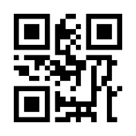

# Waveshare Barcode Scanner Module: hands-free setup

The [Waveshare Barcode Scanner Module](https://www.waveshare.com/barcode-scanner-module.htm)
is a small 1D/2D scan engine with onboard USB and UART. Plugged into a USB port it
acts as a **HID keyboard ("keyboard wedge")**: it types the scanned code into whatever
field is focused, so it works on the Manage page out of the box with no software setup.

By default it only scans while you hold the button. For a kitchen kiosk you usually want
it **hands-free**: present a product and it scans on its own. This page has the
configuration codes to do that. You set the module by scanning these codes with the
module itself, so display this page on a screen (or print it) and scan each code in order.

These codes are taken from the official Waveshare "Barcode Scanner Module Setting Manual"
(V2.1). The full manual has every other setting; this page collects just the ones that
matter for a hands-free Pantry Raider kiosk.

## How configuration works

- The module is configured by **scanning configuration codes**, not by software.
- Each code writes one setting. Scan them one at a time; the module beeps to confirm.
- A setting is **not permanent** until you scan **Save as user default** (last section),
  so a power cycle keeps it.
- If anything gets into a bad state, scan **Restore factory setting** and start over.

> Tip: it is easiest to do this on a phone or laptop browser with this page open, the
> module pointed at the screen. Keep the module 4 to 15 cm from the screen and hold steady.

## Recommended: hands-free kiosk setup

Scan these four codes in order, then the **Save** code at the bottom.

### 1. Sensing Mode (hands-free)

The module watches for a change in brightness (something entering its view), scans, then
goes back to watching. No button press. You can still press the button to scan manually.

### 2. Non-scanning interval: 500 ms

After a scan, how long the module waits before it starts watching again. The default is
1 s; 500 ms feels snappier at a checkout-style flow.

### 3. Enable "same barcode" delay

Without this, leaving an item in front of the sensor re-scans it many times. This turns on
a cooldown so the same barcode is not read again right away.

### 4. Same-barcode delay: 3 seconds

The cooldown length for the setting above. 3 s suits adding groceries one at a time. Use
the 5 s code in the Optional section instead if you find items getting double-counted.

> Pantry Raider already de-duplicates: scanning the same barcode again just bumps the
> item's quantity on the pending list rather than creating a second row. The hardware
> delay above is still worth setting so the sensor does not flood the queue while an item
> sits in view.

### Save your settings

Scan this last so the configuration survives a power cycle.

## Optional codes

### Faster wake: high sensitivity

Makes the module quicker to react when something enters its field of view. Handy if
Sensing Mode feels sluggish; can cause more stray scans in a busy area.

### Faster wake: image stabilization 100 ms

How long the module settles the image after detecting a change before it scans. Default is
400 ms; 100 ms is more responsive.

### Longer cooldown: same-barcode delay 5 seconds

Use instead of the 3 s code if single items are being scanned more than once.

### Continuous Mode (alternative to Sensing)

Scans on a repeating timer whether or not something is in view. Simpler than Sensing Mode
but reads more aggressively, so you get more stray scans. Single-press the button to pause
or resume. Prefer Sensing Mode for a kiosk.

### Back to button-press: Manual Mode

Returns the module to the default, where it only scans while you hold the button.

## Output mode (only if it stops typing)

A USB-connected module should already act as a keyboard. If it ever stops typing into the
page (for example after a factory reset that left it in serial mode), scan these two to put
it back in keyboard-wedge mode.

### USB HID device

### HID-KBW (keyboard wedge)

## Reset

If the module is misconfigured, scan this to return everything to factory defaults, then
redo the recommended codes above.

## Using it with Pantry Raider

Once the module is in Sensing Mode, open the **Manage** page and present a barcode. With the **Stock up** mode active, the
code is captured anywhere on the page (you do not need to click into a field first), looked
up against Open Food Facts with your defaults applied, and queued for review. Confirm and
commit from the **Review** page. On a Pi Remote the scan is saved on the main server, so it
shows up in the server's Review list and on every device at once.

See also: [Headless wireless barcode scanner via Home Assistant](https://github.com/Syracuse3DPrintingOrg/PantryRaider/blob/main/homeassistant/barcode-scanner.md)
for the alternative `keyboard_remote` automation path.
